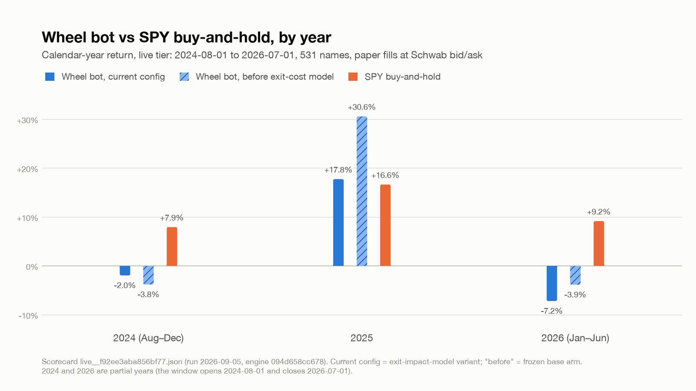

# Wheel Bot

I sell cash-secured puts and covered calls (the "wheel") by fixed rules. I tested it on 531 US large-cap stocks with five years of option chains, filling at the bid and ask a real order would get. Paper trading only.



Yearly return of the current config against SPY buy-and-hold, 2024-08-01 to 2026-07-01 (2024 is Aug to Dec, 2026 is Jan to Jun). From the scorecard in `bench/scorecards/exit-impact-model/`, dated 2026-09-05.

## Thesis

I sell a cash-secured put on a company I would own anyway and get paid to wait for a price I like. If the stock holds I keep the premium and do it again. If it falls through the strike I own it below where it was and sell calls against it until it gets called away. To beat holding the same names, the premium has to cover the assignments that keep falling, and my picks have to be better than average, since the option market prices that tail about right. I sold puts blind on everything to see what premium alone is worth, then checked whether a selection rule adds anything.

## What I tested and what I learned

- Selling puts blind loses. I sold a 0.40-delta put on every eligible day across 153 names, 2024-01-16 to 2026-07-01 (42,226 ticker-days). It lost 11.8 bps per trade at an 81.8% win rate. The 19% of losers cost more than the wins made.
- Selection works. I ranked by volatility percentile, filled five slots from the top and got +22.92% over 2024-08-01 to 2026-07-01. The same slots in arbitrary order got +1.77%, cycles down from 142 to 79, assignment rate up from 19.7% to 32.9% (2026-08-18, before the exit-cost assumption below).
- The current config trails SPY. Over 2024-08-01 to 2026-07-01, 531 names, five slots, it returns +8.16% (Sharpe 0.34, max drawdown -21.6%, 104 cycles). SPY returned +37.34% (Sharpe 1.07, -19.0%). The exit-side cost model below is an assumption. I tried roughly ninety variations of exits, entry gates and slot counts on the same dates. None reached SPY. The best got +31.83%. In a bull market this strong the premium does not cover what holding would have paid.

Things I measured and dropped (2024-08 to 2026-07 unless dated otherwise, before the exit-cost assumption):

| mechanic | number | date | what I learned |
|---|---|---|---|
| IV-rank as the ranking key | +10.05% vs +22.92% | 2026-08-22 | High implied vol picks the names the market is already scared of |
| Put stop-loss at 30% | -10.8% vs +22.9% | 2026-08-17 | Stops sell dips that mostly recover. The losses hit many names at once, so a per-position stop does not help |
| Rolling tested puts | 143 of 143 candidate rolls on a nine-year SPY wheel were net-debit | 2026-07-13 | There was no roll for credit when I needed one |
| Entry "weather" gates, ten definitions | none cut the assignment rate; deleting the gate did best, +36.4% vs -4.4% | 2026-08-16 | Put delta sets how often I get assigned. A regime label on top does not change it |
| Macro regime entry gate | GDX single-name wheel +17.5k to +4.7k on 100k | 2026-07-15 | Waiting for a good regime meant missing most of the premium |
| Out-of-the-money covered calls (0.25 / 0.35 delta) | -24.6% / -30.4% vs +22.9%; all five slots jammed with stock | 2026-08-17 | The at-the-money call gets the stock called away. The others left me holding it |

## How it was tested

Data. ThetaData end-of-day option chains, 290.6M rows, 530 of 531 tickers (NVR lists no expirations), 2021-08-09 to 2026-08-07, DTE 60 or less, about 7 GB. I bought open interest on its own: 534 tickers, 61 months, 205M rows. The stores are not in this repo. The scorecards are.

Fills. I sell at the bid and buy at the ask, Schwab quotes. Commission $0.65 plus $0.05 pass-through per contract per side, $1.40 round trip. Assignment fee $0 (not yet checked against a statement). Covered-call writes and put buybacks bigger than 10% of open interest or 25% of volume pay one extra spread. I set that as a floor on impact and have not measured the real number.

Config (frozen 2026-09-05). Put delta 0.30, call delta 0.50, target DTE 11 (band 9 to 15), put take-profit at 60% of premium, calls held to expiry, five slots, open-interest floor 10 and volume floor 4, 8% annualised yield floor on collateral, earnings blackout through expiry plus one day.

Validation. One fixed window, 2024-08-01 to 2026-07-01, 531 names. Each variant is a TOML file in `variants/` that states its pass bar before it runs. The bench scores it against the frozen config and SPY and writes a JSON scorecard. Open-interest data is complete from 2024-08 (533 of 534 tickers, against 86 of 534 before), so the window starts there.

Known gaps:

- No walk-forward and no held-out period. I scored all the variations on the same 23 months, so the search is in-sample. My only check against a lucky cell is re-scoring each candidate at 20 slots.
- The window has no sustained bear market, and that is where the wheel loses.
- Slippage is the quoted spread plus the exit-side assumption. No partial fills.

## Where it stands

Paused. Engine, fill model, bench and frozen config are done, with a result on 2024-08 to 2026-07. Paper trading against live quotes has run on a VPS since 2026-07-18. I paused the research in 2026-09 when a gap-fill question on the same universe looked more promising. I have not done a held-out test or a bear-market window. I don't know yet whether a selection rule can close a 29-point gap to SPY, or whether the wheel is a yield strategy I should judge on income and drawdown instead of total return. Next I want a 2022-style window and a scorecard that shows premium income and drawdown next to total return.

## What this is not

Paper trading only, simulated fills against real quotes, no order-placement code. Not investment advice. I am not claiming a live edge. On the window I tested there is none over SPY.

## How to run it

```
python -m venv .venv && .venv/bin/pip install -r requirements.txt
.venv/bin/pytest -q                                  # engine and bench tests on bundled fixtures
.venv/bin/python results/plot_equity_by_year.py      # rebuilds the chart from bench/scorecards/
```

Reproducing a scorecard needs the ThetaData stores (about 8 GB, licensed, not included) in `data/options/`, then `scripts/wheelbench run <variant>`. Accepted mechanics are in `bench/artifact/blocks.toml`. Fill rules are in `src/engine_v2/options/fills.py`.

## Built with

Python 3.12, pandas, pyarrow, pytest. Option chains and open interest from ThetaData; quotes for paper fills from the Schwab API. Built with AI-assisted development (Claude Code); the research questions, hypotheses, validation choices, and conclusions are mine.
